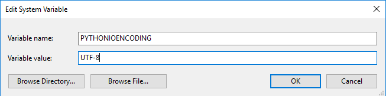

## Python 脚本输出中文为乱码

### Reproduce

test.py

```
print("Test - 中文测试")
```

.gitlab-ci.yml

```
stages:
    - test

test_jog:
    stage: test
    tags:
        - your_runner_tag
    script:
        - echo 中文输出测试
        - python --version
        - python test.py
```

output


### Fix

#### Check console's encoding

test.py

```
import sys
print(sys.stdin.encoding)
print(sys.stdout.encoding)
print("Test - 中文测试")
```

output


#### 设置Runner服务器环境变量

Environment Variables -> System variables -> New ->  PYTHONIOENCODING = UTF-8



#### 重启 Runner

```
gitlab-runner.exe restart
```

output


## 无法运行中文路径下的 Python 脚本

